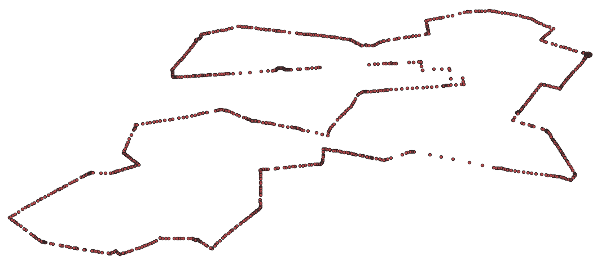

[<< Back to contents](http://github.com/alastairotter/data-visualisation-notes)

# Turn a collection of GIS co\-ordinates into an SVG path (part 1)

I had a series of GIS points (lat,lon) that I wanted to turn into an SVG path that I could use with D3.js to animate a point along that path. In this case the GIS data were the points marking out the Berlin Marathon route in 2018. 

The first step was to turn the coordinates into a .geojson file that I could use with D3.js. 

The starting data looked something like this: 

`lat,lon
52.51519655660193, 13.360063612650748
52.5151901, 13.3598804
52.5151787, 13.3596897
52.5151405, 13.3590698
52.5150833, 13.3581533
52.5150108, 13.3570499
52.5149841, 13.3566284
52.5148811, 13.3551264
52.5148392, 13.3544903
52.51474, 13.3528414
52.5147057, 13.3522854
52.5146904, 13.3520098
52.5146828, 13.3518543
52.514679, 13.3517799
...`

That was saved as a .csv file. 

To convert first to .geojson format I opened QGIS and imported the .csv file using Layer->Add Layer->Add Delimited Text Layer

Make sure your .csv has a header row before you import. During the import select which column is the "x" and which the "y". Follow any other hints. 

The result (in QGIS) is something like this: 

Once it's imported, right click on the layer you imported and select Export->Save Features As and run through the various options. Save it out to a .geojson file. That file now looks like: 

`{
"type": "FeatureCollection",
"name": "route",
"crs": { "type": "name", "properties": { "name": "urn:ogc:def:crs:OGC:1.3:CRS84" } },
"features": [
{ "type": "Feature", "properties": { "lat": 52.515196556601929, "lon": 13.360063612650748 }, "geometry": { "type": "Point", "coordinates": [ 13.360063612650748, 52.515196556601929 ] } },
{ "type": "Feature", "properties": { "lat": 52.5151901, "lon": 13.3598804 }, "geometry": { "type": "Point", "coordinates": [ 13.3598804, 52.5151901 ] } },
{ "type": "Feature", "properties": { "lat": 52.5151787, "lon": 13.3596897 }, "geometry": { "type": "Point", "coordinates": [ 13.3596897, 52.5151787 ] } },
{ "type": "Feature", "properties": { "lat": 52.5151405, "lon": 13.3590698 }, "geometry": { "type": "Point", "coordinates": [ 13.3590698, 52.5151405 ] } },
{ "type": "Feature", "properties": { "lat": 52.5150833, "lon": 13.3581533 }, "geometry": { "type": "Point", "coordinates": [ 13.3581533, 52.5150833 ] } }, 
...`
  

### References

[1] (https://gis.stackexchange.com/questions/209990/list-of-coordinates-to-topojson)  
[2] (https://gis.stackexchange.com/questions/49114/d3-geo-path-to-draw-a-path-from-gis-coordinates)